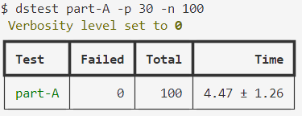

# 简介

## 内容

- 根据 Term 完成节点间的 身份切换
- 实现 Leader 的发起同步、心跳机制
- 实现 Candidator 发起投票、统计多数派票数
- 实现 Follower 发起竞选、为 Candidator 投票

Raft Part-A 调试总结

## 第一关：实验测试

执行命令

```
VERBOSE=0 go test -run part-A | tee out.txt
```

## 第二关：并发测试

安装辅助测试插件

将 dslogs 和 dstest 复制到 C:/Windows/System32

执行 `dslogs -c 3 out.txt` 高亮分区查看日志（在 raft 目录下）
执行 `dstest part-A -p 30 -n 100` 进行并行测试

