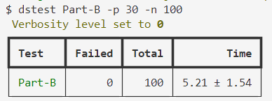

# 简介

## 内容

- 实现 Leader 的日志 commit 功能（startReplication）
- 实现 Follower 有日志丢失匹配的功能（if !reply.Success）
- 实现已提交部分的 wal 的 apply 功能（applyTicker）

Raft Part-B 调试总结

## 第一关：实验测试

执行命令

```
go test -run part-B 
VERBOSE=0 go test -run part-B | tee out.txt
```

## 第二关：并发测试

安装辅助测试插件

将 dslogs 和 dstest 复制到 C:/Windows/System32

执行 `dslogs -c 3 out.txt` 高亮分区查看日志（在 raft 目录下）
执行 `dstest part-B -p 30 -n 100` 进行并行测试

