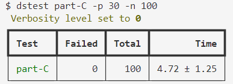

# 简介

## 内容

- 实现 wal 的持久化功能，即 stable index
- 实现 wal 的状态恢复功能

Raft PartB 调试总结

## 第一关：实验测试

执行命令

```
go test -run part-C

VERBOSE=0 go test -run part-C | tee out.txt
```

## 第二关：并发测试

安装辅助测试插件

将 dslogs 和 dstest 复制到 C:/Windows/System32

执行 `dslogs -c 3 out.txt` 高亮分区查看日志（在 raft 目录下）
执行 `dstest part-C -p 30 -n 100` 进行并行测试

